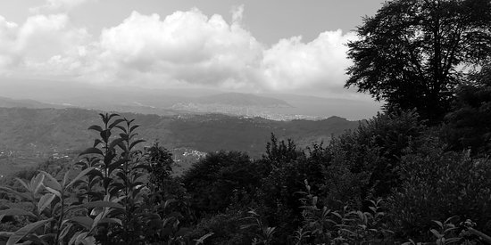

# Visual Colorization: Deep Learning ile Manzara Fotoğrafı Renklendirme

Bu proje, siyah-beyaz (monokrom) manzara fotoğraflarını yapay zeka kullanarak otomatik olarak renklendirmeyi amaçlayan bir Derin Öğrenme (Deep Learning) projesidir. Geleneksel görüntü işleme filtrelerinin aksine, bu sistem sahnelerin yapısal özelliklerini (gökyüzü, deniz, ağaçlar, binalar) öğrenerek gerçeğe en yakın pikselleri sentezleyen **Evrişimli Otokodlayıcı (Convolutional Autoencoder)** mimarisi üzerine inşa edilmiştir.

Renklendirme işlemi için insan gözünün algısına en uygun olan **LAB renk uzayı** (CIE L*a*b*) tercih edilmiştir. Model, yalnızca parlaklık (Lightness) kanalını girdi olarak alıp, eksik olan A ve B (renk) kanallarını tahmin edecek şekilde eğitilmiştir.

## Özellikler ve Temel Metrikler

| Bileşen | Detaylar |
| :--- | :--- |
| **Mimari Türü** | Convolutional Autoencoder (Evrişimli Otokodlayıcı) |
| **Framework** | PyTorch (`torch.nn`, `torch.optim`, `torchvision`) |
| **Görüntü Boyutu** | 256x256 piksel |
| **Renk Uzayı** | CIE LAB (Input: `L`, Output: `A, B`) |
| **Parametre Sayısı**| 1,077,218 (Yaklaşık 1 Milyon) |
| **Optimizasyon** | Adam Optimizer, MSELoss, ReduceLROnPlateau Scheduler |

## Sistem Mimarisi (Görüntü İşleme Hattı)

Sistem, görüntü verilerini klasik RGB formatından LAB formatına dönüştürerek çalışır. Model, yalnızca siyah-beyaz yapıyı (L) görür ve renklendirmeyi (AB) kendi öğrenilmiş ağırlıklarıyla üretir.

```text
┌───────────────────────────────────────────────────────────────────┐
│                          DATA PIPELINE                            │
│  RGB Görüntü ──► skimage.color (RGB2LAB) ──► Normalizasyon (0-1)  │
└──────────────────────────┬────────────────────────────────────────┘
                           │
┌──────────────────────────▼────────────────────────────────────────┐
│                   AUTOENCODER ARCHITECTURE                        │
│                                                                   │
│  [INPUT: L Channel] (Siyah-Beyaz / Boyut: 1x256x256)              │
│       │                                                           │
│       ├──► ENCODER (4x Conv2d + ReLU)                             │
│       │      Daraltma: 32 ──► 64 ──► 128 ──► 256                  │
│       │                                                           │
│       └──► DECODER (4x ConvTranspose2d + ReLU/Tanh)               │
│              Genişletme: 128 ──► 64 ──► 32 ──► 2                  │
│                                                                   │
│  [OUTPUT: AB Channels] (Tahmin Edilen Renkler / Boyut: 2x256x256) │
└──────────────────────────┬────────────────────────────────────────┘
                           │
┌──────────────────────────▼────────────────────────────────────────┐
│                        POST-PROCESSING                            │
│   Ters Normalizasyon ──► LAB Kanallarının Birleştirilmesi         │
│          skimage.color (LAB2RGB) ──► Renkli Final Çıktı           │
└───────────────────────────────────────────────────────────────────┘
```

## Eğitim (Training) Konfigürasyonu

Model, Kaggle üzerindeki `landscape-image-colorization` veri seti kullanılarak eğitilmiştir. 
* **Veri Dağılımı:** 5703 Eğitim, 713 Doğrulama (Validation), 713 Test görüntüsü.
* **Hiperparametreler:** 
  * Epoch: 300
  * Batch Size: 32
  * Learning Rate: 1e-3 (Patience: 5, Factor: 0.5 ile dinamik olarak azaltılır)
* **Kayıp Fonksiyonu (Loss):** Ortalama Kare Hata (MSE - Mean Squared Error).
* **Donanım:** NVIDIA Tesla T4 GPU (CUDA).

Eğitim sürecinde, en düşük Validation Loss değerini (0.00781) elde eden ağırlıklar `best_model.pth` olarak kaydedilmiştir.

## Test Sonuçları ve Başarım

Test veriseti üzerinden rastgele seçilen görüntülerle yapılan çıkarım (inference) sonuçları aşağıdaki gibidir:



* **Üst Satır (Gri Giriş):** Modele verilen `L` kanalı (sadece parlaklık).
* **Orta Satır (Tahmin):** Modelin sıfırdan ürettiği `A` ve `B` kanallarının `L` ile birleştirilmesi sonucu elde edilen renkli görüntüler.
* **Alt Satır (Gerçek):** Orijinal (Ground Truth) RGB fotoğraflar.

Sonuçlar incelendiğinde; modelin gökyüzü (mavi/açık tonlar), bitki örtüsü (yeşil tonları), deniz suyu ve şehir mimarisi gibi kompleks sahneleri başarıyla tanıdığı ve yüksek oranda gerçeğe yakın, doğal renk dağılımları üretebildiği görülmektedir.

## Kurulum ve Kullanım

**Gereksinimler**
* Python 3.9+
* PyTorch (CUDA destekli önerilir)
* `scikit-image`, `numpy`, `matplotlib`, `Pillow`

**Kullanım**
1. Repoyu klonlayın.
2. Bağımlılıkları yükleyin: `pip install torch torchvision numpy matplotlib scikit-image`
3. `Notebooks/visual-colorization.ipynb` dosyasını Jupyter ortamında açın.
4. Kaydedilmiş `best_model.pth` ağırlıklarını modele yükleyerek doğrudan kendi monokrom fotoğraflarınızı renklendirmek için test hücrelerini çalıştırın.

## Proje Yapısı

```text
visual-colorization/
│
├── Datasets/
│   ├── DATA.txt                       # Veri seti bağlantıları ve indirme yönergeleri
│   └── monokrom-fotoraflari.jpg       # Test için kullanılan örnek monokrom görüntüler
│
├── Models/
│   └── best_model.pth                 # Eğitilmiş PyTorch Autoencoder ağırlıkları
│
├── Notebooks/
│   └── visual-colorization.ipynb      # Veri yükleme, model inşası, eğitim ve test kodları
│
└── README.md                          # Proje Dokümantasyonu
```
